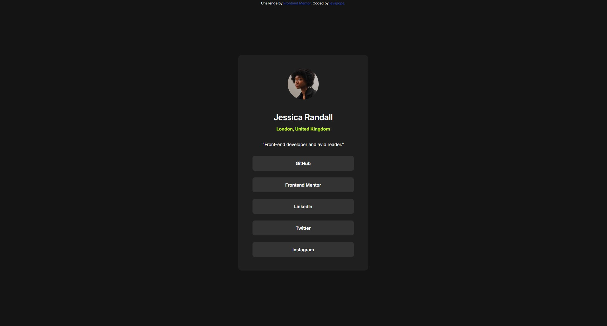

# Frontend Mentor - Social links profile solution

This is a solution to the [Social links profile challenge on Frontend Mentor](https://www.frontendmentor.io/challenges/social-links-profile-UG32l9m6dQ).

### Screenshot

### Links

- Solution URL: https://github.com/leviipope/frontend-mentor-social-links
- Live Site URL: https://leviipope.github.io/frontend-mentor-social-links/
- Personal Website - https://leviipope.github.io/cv-website
- Frontend Mentor - [@leviipope](https://www.frontendmentor.io/profile/leviipope)

### Built with

- Semantic HTML5 markup
- CSS custom properties
- Flexbox

### Note

Used flexbox first time in a project, and suprised to find that it's really easy to work with.